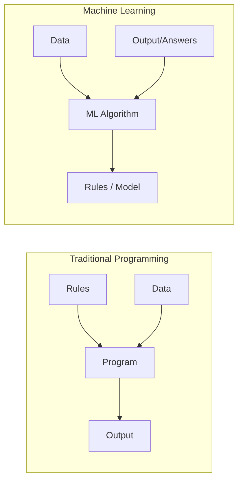
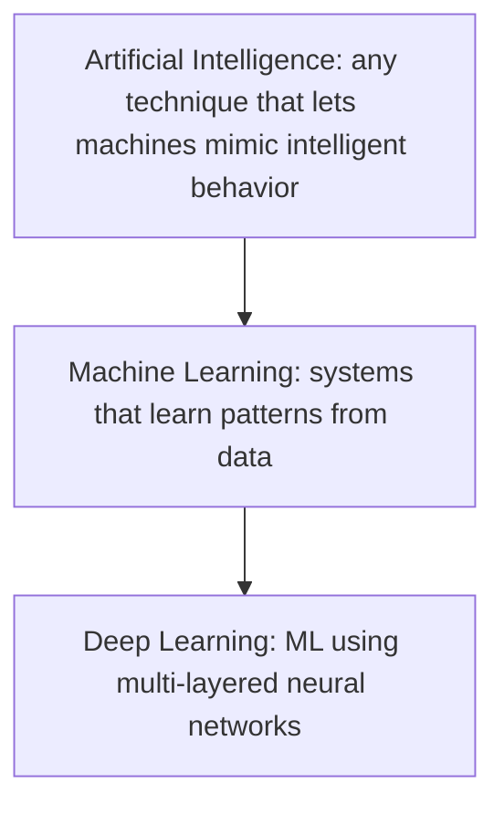
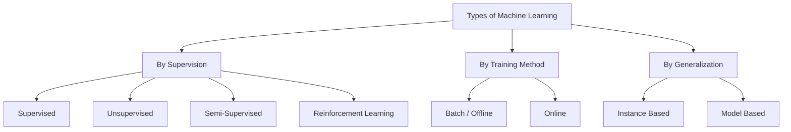
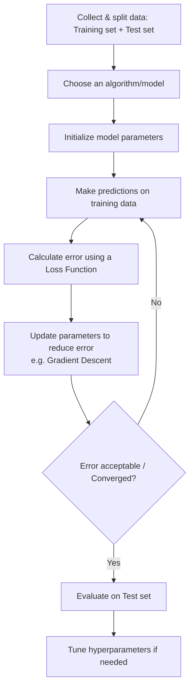
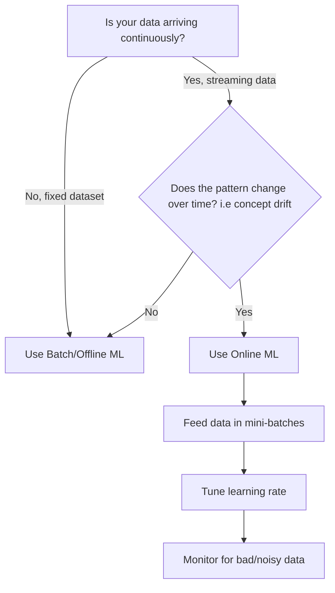
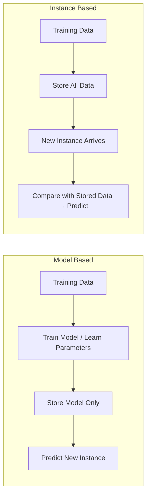
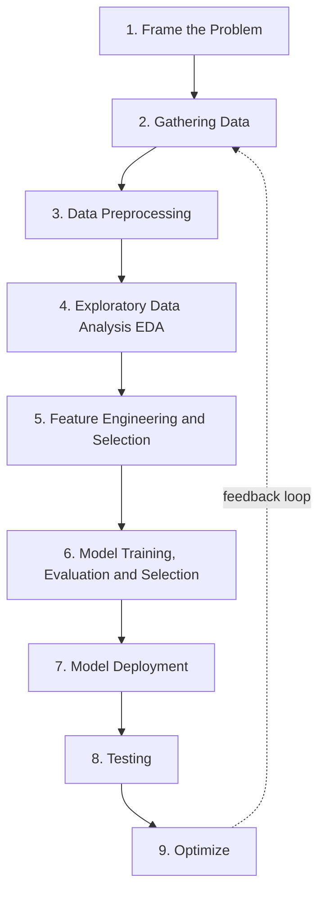

# Introduction to Machine Learning

> Category: `machine-learning-fundamentals`
> Session: Day 1 — Introduction to ML (What is ML, History, AI vs ML vs DL, Types of ML, How models are trained, Batch/Online ML, Instance/Model based learning, Challenges, Applications, MLDLC, Job Roles, Tensors, Tools)

## Table of Contents
1. [What is Machine Learning](#1-what-is-machine-learning)
2. [History of Machine Learning](#2-history-of-machine-learning)
3. [AI vs ML vs DL](#3-ai-vs-ml-vs-dl)
4. [Types of Machine Learning](#4-types-of-machine-learning)
5. [How are ML Models Trained](#5-how-are-ml-models-trained)
6. [Batch vs Online Machine Learning](#6-batch-vs-online-machine-learning)
7. [Instance Based vs Model Based Learning](#7-instance-based-vs-model-based-learning)
8. [Challenges in Machine Learning](#8-challenges-in-machine-learning)
9. [Applications of Machine Learning](#9-applications-of-machine-learning)
10. [Machine Learning Development Life Cycle (MLDLC)](#10-machine-learning-development-life-cycle-mldlc)
11. [Job Roles in Data & ML](#11-job-roles-in-data--ml)
12. [Tensors](#12-tensors)
13. [Setting Up Tools](#13-setting-up-tools)
14. [Additional Notes (Beyond the Session Content)](#14-additional-notes-beyond-the-session-content)

---

## 1. What is Machine Learning

> *Note: this topic wasn't in the uploaded notes — added from general knowledge to match the video outline.*

**Simple definition:** Machine Learning is a way of teaching computers to learn patterns from data and make decisions or predictions, **without being explicitly programmed** with fixed rules for every situation.

**Classic definitions worth knowing:**
- **Arthur Samuel (1959):** "Machine Learning is the field of study that gives computers the ability to learn without being explicitly programmed."
- **Tom Mitchell (1997):** A program learns from **Experience (E)** with respect to some **Task (T)** and **Performance measure (P)**, if its performance at T, measured by P, improves with E.

**Traditional Programming vs Machine Learning:**



- In **traditional programming**, you write the rules yourself (e.g. `if income > 50000: approve loan`).
- In **machine learning**, you give the algorithm data + the correct answers, and it **figures out the rules (model)** on its own.

---

## 2. History of Machine Learning

> *Note: this topic wasn't in the uploaded notes — added from general knowledge to match the video outline.*

| Era | Milestone |
|---|---|
| 1950 | Alan Turing proposes the "Turing Test" — can a machine exhibit intelligent behavior indistinguishable from a human? |
| 1952 | Arthur Samuel writes a checkers-playing program that improves with experience — one of the earliest ML programs |
| 1957 | Frank Rosenblatt invents the **Perceptron** — an early neural network model |
| 1980s | Rise of **Expert Systems** — rule-based AI, followed by a slowdown known as the "AI Winter" due to high expectations and limited compute |
| 1990s | Shift toward **statistical learning** — Support Vector Machines, Decision Trees, ensemble methods gain popularity |
| 2006 | Geoffrey Hinton popularizes **Deep Learning**, reviving interest in neural networks |
| 2012 | **AlexNet** wins the ImageNet competition by a huge margin, proving deep neural networks work at scale — sparks the modern deep learning boom |
| 2017 | The **Transformer** architecture is introduced, laying the foundation for modern NLP models |
| 2020s | Rise of **Large Language Models (LLMs)** and generative AI, built on the transformer architecture |

---

## 3. AI vs ML vs DL

> *Note: this topic wasn't in the uploaded notes — added from general knowledge to match the video outline.*

These three terms are often used interchangeably, but they are **nested subsets** of each other:



| Term | Definition | Example |
|---|---|---|
| **AI (Artificial Intelligence)** | The broadest field — any technique that makes machines act "intelligently" (includes rule-based systems, search algorithms, ML, etc.) | A chess engine using hardcoded rules |
| **ML (Machine Learning)** | A subset of AI where systems learn patterns from data instead of following hardcoded rules | Spam email classifier trained on labeled emails |
| **DL (Deep Learning)** | A subset of ML that uses neural networks with many layers to learn complex patterns, especially from unstructured data (images, text, audio) | Face recognition using a Convolutional Neural Network (CNN) |

---

## 4. Types of Machine Learning

> *Note: this topic wasn't in the uploaded notes — added from general knowledge to match the video outline. (Batch vs Online, and Instance vs Model based, are sub-classifications covered in detail in sections 6 and 7 below.)*

Machine Learning is broadly classified along a few different dimensions:

### By the kind of supervision
| Type | Description | Example |
|---|---|---|
| **Supervised Learning** | Trained on labeled data (input + correct output) | Predicting house prices from features + known sale prices |
| **Unsupervised Learning** | Trained on unlabeled data, finds hidden patterns/structure | Customer segmentation using clustering |
| **Semi-Supervised Learning** | Trained on a mix of labeled + unlabeled data | Photo organizing apps using a few tagged faces to label an entire photo library |
| **Reinforcement Learning** | An agent learns by interacting with an environment, receiving rewards/penalties | A game-playing AI (e.g. AlphaGo) or a robot learning to walk |

### By how the model is trained/updated
- **Batch (Offline) ML** vs **Online ML** — covered in detail in [Section 6](#6-batch-vs-online-machine-learning).

### By how the model generalizes
- **Instance Based Learning** vs **Model Based Learning** — covered in detail in [Section 7](#7-instance-based-vs-model-based-learning).



---

## 5. How are ML Models Trained

> *Note: this topic wasn't in the uploaded notes — added from general knowledge to match the video outline.*

At a high level, training a machine learning model follows this general process:



**How it works — step by step, in plain terms:**
1. **Split your data** — commonly 80% for training, 20% for testing, so you can check performance on data the model hasn't seen.
2. **Pick a model type** — e.g. Linear Regression, Decision Tree, Neural Network — based on your problem (classification, regression, etc.)
3. **Define a Loss Function** — a formula that measures how wrong the model's predictions are (e.g. Mean Squared Error for regression).
4. **Optimize** — an algorithm like **Gradient Descent** repeatedly adjusts the model's internal parameters (weights) to reduce the loss.
5. **Repeat** — this process runs over many iterations ("epochs") until the loss stops improving significantly (convergence).
6. **Evaluate** — test the trained model on unseen data (the test set) to check it generalizes well, not just memorizes the training data.
7. **Tune hyperparameters** — adjust settings like learning rate, number of layers, or tree depth, and repeat until performance is satisfactory.

---
## 6. Batch vs Online Machine Learning

### 6.1 Batch / Offline ML
The model is trained on the **entire dataset at once**, offline, and then deployed. It does **not** learn incrementally — to update it, you retrain from scratch on old + new data.

**Problem with Batch Learning**
- **Lots of Data** — training on the full dataset repeatedly is expensive as data grows.
- **Hardware Limitation** — large datasets may not fit in memory/compute available.
- **Availability** — the model can go "stale" between training cycles since it doesn't see new data until the next retrain.

**Disadvantages of Batch ML**
- Retraining from scratch is costly (time + compute).
- Not suitable when data changes rapidly (concept drift).
- Not ideal for systems needing real-time adaptation.

### 6.2 Online Machine Learning
The model is trained **incrementally**, on small batches ("mini-batches") or one instance at a time, as data arrives.

**Why use Online ML**
- **Concept drift** — when the statistical properties of data change over time (e.g. stock prices, fraud patterns), online learning adapts continuously.
- **Cost effective** — no need to retrain the full model from scratch every time.
- **Faster solution** — updates happen quickly with new data.

**When to use it**
- Continuous data streams (sensor data, stock trades, user clicks).
- Systems where retraining on full data is not feasible (data too large to fit in memory).
- Situations needing fast adaptation to new patterns.

**How to implement**
- Feed data in small chunks ("mini-batches") to the model using incremental learning APIs (e.g. `partial_fit()` in scikit-learn).

**Learning Rate**
- Controls **how fast the model adapts to new data**.
- High learning rate → model adapts fast but may forget old patterns too quickly (unstable).
- Low learning rate → model adapts slowly but is more stable.

**Out-of-Core Learning**
- A technique to train on datasets **too large to fit in RAM**, by loading and learning from the data in small chunks sequentially from disk.

**Disadvantages of Online ML**
- **Tricky to use** — needs careful monitoring and pipeline design.
- **Risky** — if bad/noisy data comes in, the model can degrade quickly since it updates continuously.

### Batch vs Online — Comparison Table

| Features | Offline (Batch) Learning | Online Learning |
|---|---|---|
| Complexity | Less complex, model is constant | Dynamic complexity, model keeps evolving |
| Computational Power | Fewer computations, single time batch-based training | Continuous ingestion → continuous refinement computations |
| Use in Production | Easier to implement | Difficult to implement and manage |
| Applications | Image classification / stable-pattern ML tasks | Finance, economics, healthcare — where patterns constantly emerge |
| Tools | Industry proven: Scikit-learn, TensorFlow, PyTorch, Keras, Spark MLlib | Active research tools: MOA, SAMOA, scikit-multiflow, streamDM |

### How to decide — Batch vs Online (flow)



---

## 7. Instance Based vs Model Based Learning

### 7.1 Instance Based Learning
The system learns the training examples **by heart** and generalizes to new cases by comparing them to the stored examples using a similarity measure (e.g. k-Nearest Neighbors).

### 7.2 Model Based Learning
The system builds a **general model** from the training examples (learns parameters), then uses that model to make predictions — not the raw stored data.

### Differences — Comparison Table

| Usual/Conventional ML (Model Based) | Instance Based Learning |
|---|---|
| Prepare the data for model training | Prepare the data for model training — no difference here |
| Train model from training data to estimate parameters (discover patterns) | Do not train a model — pattern discovery is postponed until a scoring query is received |
| Store the model in suitable form | There is no model to store |
| Generalize rules into a model, even before scoring instance is seen | No generalization before scoring — only generalizes per scoring instance individually, as and when seen |
| Predict for unseen instance using the model | Predict for unseen instance using training data directly |
| Can discard training data after training | Must keep training data — each query uses part/full training set |
| Requires a known model form | May not have an explicit model form |
| Storing models generally requires less storage | Storing training data generally requires more storage |

**Practical example:**
- **Model based** → Linear Regression learns coefficients (`y = mx + c`) from housing data, then discards the raw data and just uses `m` and `c` to predict new house prices.
- **Instance based** → k-Nearest Neighbors keeps *all* housing data, and for a new house, looks up the "k" most similar houses in the stored data to predict its price.



---

## 8. Challenges in Machine Learning

| # | Challenge | What it means |
|---|---|---|
| 1 | Data Collection | Gathering enough relevant data is often difficult/expensive |
| 2 | Insufficient Data / Labelled Data | Many algorithms (esp. supervised) need large labelled datasets |
| 3 | Non-Representative Data | Training data doesn't reflect the real-world distribution → poor generalization |
| 4 | Poor Quality Data | Noisy, missing, or inconsistent data hurts model performance |
| 5 | Irrelevant Features | Features that don't help prediction add noise and slow training |
| 6 | Overfitting | Model learns training data (incl. noise) too well, fails on new/unseen data |
| 7 | Underfitting | Model is too simple to capture the underlying pattern in the data |
| 8 | Software Integration | Difficulty integrating trained models into existing software systems |
| 9 | Offline Learning / Deployment | Challenges in taking a model from experimentation to a live, running system |
| 10 | Cost Involved | Data collection, compute, storage, and expert time are all costly |

### Overfitting vs Underfitting — visual intuition

**Underfitting (High Bias)** — model is too simple, misses the real pattern:
```
y
|
|    o           o
|        o             o
|  o          o
| ------------------------    <- straight line, ignores the curve
|________________________ x
```

**Good Fit** — model captures the true underlying trend without chasing noise:
```
y
|
|    o                 o
|         .  .  .
|  o    .        .   o
|     .              .
|________________________ x
       (smooth curve fits the pattern well)
```

**Overfitting (High Variance)** — model is too complex, chases every single point including noise:
```
y
|
|    o     o          o
|     \   / \        / \
|  o   \ /   \      /   \   o
|       X     \    /     \
| o    / \     \  /       \  o
|________________________ x
   (wiggly line hits every point, including noise)
```

---

## 9. Applications of Machine Learning

| Domain | Example |
|---|---|
| Retail | Recommendation & inventory systems (e.g. Amazon, Big Bazaar) |
| Banking and Finance | Fraud detection, credit scoring, customer service automation |
| Transport | Dynamic pricing / route optimization (e.g. Ola, Uber) |
| Manufacturing | Robotics & quality control on production lines (e.g. Tesla) |
| Consumer Internet | Content ranking, trend detection, feed personalization (e.g. Twitter) |

---

## 10. Machine Learning Development Life Cycle (MLDLC)



**Step-by-step meaning:**
1. **Frame the Problem** — define the business problem as an ML problem (classification, regression, clustering, etc.)
2. **Gathering Data** — collect data from databases, APIs, scraping, logs, etc.
3. **Data Preprocessing** — clean data: handle missing values, duplicates, formatting.
4. **EDA** — explore data visually/statistically to find patterns, correlations, outliers.
5. **Feature Engineering & Selection** — create/select the most useful input variables for the model.
6. **Model Training, Evaluation & Selection** — train multiple models, evaluate with metrics, pick the best.
7. **Model Deployment** — push the trained model into a production environment (API, app, etc.)
8. **Testing** — validate the deployed model works correctly in the real environment.
9. **Optimize** — monitor performance over time and improve/retrain as needed.

---

## 11. Job Roles in Data & ML

### Data Engineer
- **Responsibilities:** Scrape data from sources; move/store data in optimal servers/warehouses; build data pipelines/APIs; handle databases/warehouses.
- **Skills:** Algorithms & data structures, Java/R/Python/Scala, advanced DBMS, Big Data tools (Spark, Hadoop, Kafka, Hive), cloud platforms (AWS, GCP), distributed systems, data pipelines.

### Data Analyst
- **Responsibilities:** Clean/organize raw data; analyze data for insights; create visualizations; produce/maintain reports; collaborate on insights; optimize data collection.
- **Skills:** Statistical programming (R/SAS/Python), creative & analytical thinking, business acumen, communication, data mining/cleaning, data visualization & storytelling, SQL, advanced Excel.

### Data Scientist
> "A data scientist is someone who is better at statistics than any software engineer, and better at software engineering than any statistician."

### ML Engineer
- **Responsibilities:** Deploy ML models to production; scale/optimize models for production; monitor and maintain deployed models.
- **Skills:** Mathematics, R/Python/Java/Scala, distributed systems, data modeling & evaluation, ML models, software engineering & systems design.

### Comparison Table

| Role | Analytical Skills | Business Acumen | Data Storytelling | Soft Skills | Software Skills |
|---|---|---|---|---|---|
| Data Analyst | High | Medium to High | High | Medium to High | Medium |
| Data Engineer | Medium | Low | Low | Medium | High |
| Data Scientist | High | High | High | High | Medium |
| ML Engineer | Medium to High | Medium | Low | High | High |

---

## 12. Tensors

Tensors are just **generalized containers for numbers**, categorized by their **rank/dimensionality**.

| Tensor | Also known as | Example |
|---|---|---|
| 0D Tensor | Scalar | A single number, e.g. `5` |
| 1D Tensor | Vector | A list of numbers, e.g. `[5, 3, 8]` |
| 2D Tensor | Matrix | A table of numbers (rows × columns) |
| 3D Tensor | — | A stack of matrices (e.g. a single color image: height × width × channels) |
| 4D Tensor | — | A batch of 3D tensors (e.g. a batch of color images) |
| 5D Tensor | — | A batch of 4D tensors (e.g. a batch of videos: samples × frames × height × width × channels) |

### Rank, Axes, and Shape — how to use it, step by step
- **Rank** = number of dimensions (axes) a tensor has.
- **Axes** = each individual dimension.
- **Shape** = the size along each axis.

**Worked example — a single color image:**
- An image that is 64 pixels tall, 64 pixels wide, with 3 color channels (RGB) is a **3D tensor**.
- Its **shape** is written as `(64, 64, 3)`.
- Its **rank** is `3` (three axes: height, width, channels).

**Worked example — a batch of images (4D Tensor):**
- Say you have 32 such images together (a "batch").
- Shape becomes `(32, 64, 64, 3)` → this is a **4D tensor**.
  - Axis 1 → batch size (32 images)
  - Axis 2 → height (64)
  - Axis 3 → width (64)
  - Axis 4 → channels (3, for RGB)

**Worked example — a batch of videos (5D Tensor):**
- 10 videos, each with 30 frames, each frame 64×64 pixels, RGB.
- Shape = `(10, 30, 64, 64, 3)` → a **5D tensor**.
  - `10` videos → `30` frames each → `64×64` resolution → `3` color channels.

---

## 13. Setting Up Tools

| Tool | Purpose |
|---|---|
| Anaconda | Package/environment manager for Python data science stacks |
| Jupyter Notebook | Interactive coding environment for data exploration |
| Virtual Environments | Isolate project dependencies to avoid version conflicts |
| Kaggle | Platform for datasets, competitions, and free notebooks/GPUs |
| Google Colab | Free cloud-based Jupyter notebooks with GPU/TPU access |
| Running Kaggle data on Colab | Using Kaggle's API to pull datasets directly into a Colab notebook |

---

## 14. Additional Notes (Beyond the Session Content)

### Related concepts not explicitly in the PDF
- **Concept Drift** (mentioned above) has two common types:
  - *Sudden drift* — an abrupt change (e.g. a pandemic changing shopping behavior overnight).
  - *Gradual drift* — a slow change over time (e.g. language/slang evolving in text data).
- **Bias-Variance Tradeoff** ties directly into Overfitting/Underfitting:
  - High bias → underfitting.
  - High variance → overfitting.
  - Goal: find the sweet spot that generalizes well to unseen data.
- **Batch size** in online/incremental learning is a tunable hyperparameter — too small and training is noisy, too large and you lose the "online" advantage of quick updates.
- **MLOps** is the real-world discipline covering deployment, monitoring, and optimize steps (7–9) of the MLDLC at scale — worth exploring once you're comfortable with the basics.

### Common ML/Data Science Use Cases by Concept
| Concept | Real-world use case |
|---|---|
| Online ML | Fraud detection systems that must adapt to new fraud patterns daily |
| Instance Based Learning | Recommendation engines using k-NN based on similar user behavior |
| Tensors | Deep learning frameworks like TensorFlow/PyTorch represent all data (images, text, video) as tensors |
| MLDLC | Any real-world ML product pipeline, from a spam filter to a self-driving car's perception system |

### Quick Python Reference

```python
import numpy as np
import pandas as pd
from sklearn.linear_model import SGDClassifier  # good for Online/incremental learning

# ---- Tensors with numpy ----
scalar = np.array(5)                     # 0D tensor
vector = np.array([5, 3, 8])             # 1D tensor
matrix = np.array([[1, 2], [3, 4]])      # 2D tensor
image  = np.random.rand(64, 64, 3)       # 3D tensor (single RGB image)
batch_of_images = np.random.rand(32, 64, 64, 3)  # 4D tensor (batch of images)

print("Rank of image tensor:", image.ndim)     # 3
print("Shape of image tensor:", image.shape)   # (64, 64, 3)

# ---- Online / Incremental Learning example ----
model = SGDClassifier()

# Simulate streaming data in mini-batches
for X_batch, y_batch in stream_of_batches:  # pseudo-loop, replace with real data
    model.partial_fit(X_batch, y_batch, classes=[0, 1])

# ---- Simple EDA with pandas ----
df = pd.read_csv("data.csv")
print(df.describe())        # summary statistics
print(df.isnull().sum())    # check missing values
```
